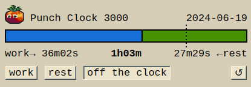

# Punch Clock 3000: A Time Tracker

Have you even wondered how much time you spend actually working when you're working?

Here's a client/server utility ([source](https://github.com/zvold/zvold.github.io/tree/main/src/time3)) for tracking the proportion of time spent *working* (as opposed to *resting*) during the work day.

The client is HTML/Javascript, communicates with the server over HTTP (GET and POST) and WebSocket and looks like this:



The server is written in Go. It is intended to be self-hosted:

```
go run github.com/zvold/zvold.github.io/src/time3@v0.5.0 [-port=<port>] [-https] [-v]
```

This was inspired by the article [Third Time: a better way to work](https://www.lesswrong.com/posts/RWu8eZqbwgB9zaerh/third-time-a-better-way-to-work) and the related [HN discussion](https://news.ycombinator.com/item?id=40378993).

The app doesn't follow the "third time" technique strictly (nor was it the goal): no alarms, no meal breaks / big breaks with specific end time, etc. Rather, it allows to roughly target a certain work/rest ration (default is 75%, configurable via URL parameter `?t=`).

Update: [Punch Clock 3000: Now With History](../2025-06-23/punch-clock-3000-now-with-history.md).

