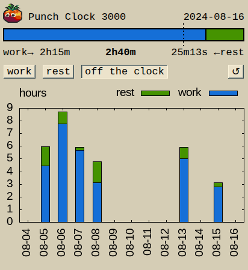

# Punch Clock 3000: Now With History

I've been using this time tracker app [that I wrote](../2024-06-23/punch-clock-3000-a-time-tracker.md) for about a year now.

Every day in the morning, I'd make a screenshot of the previous day, and then press 'reset' to start tracking the new day.

On one hand, it became a kind of a ritual, which I think helps me to not forget restarting the tracker. On another hand, having a doc with one year worth of screenshots, just so I could see the high-level picture is suboptimal.

So, I've finally decided to automate this process somewhat:
- At the end of each day, the server stores the work / rest values into the database.
- The client GUI shows a few weeks worth of historical data as a stacked histogram.



The server now supports the optional flag for specifying the database path:

```
go run github.com/zvold/zvold.github.io/src/time3@v0.7.0 [-port=<port>] [-https] [-db=<path>] [-v]
```

One downside is that now there is a `gnuplot` dependency, which should be installed alongside the server.

Another is that `mattn/go-sqlite3` is a cgo package. This complicates cross-compiling to arm64 slightly, but making a static binary is still easy enough (see [this](https://stackoverflow.com/a/75368290)):

```shell
wget -P ~ https://musl.cc/aarch64-linux-musl-cross.tgz

cd ~/tools && tar xvzf ~/aarch64-linux-musl-cross.tgz

GOOS=linux GOARCH=arm64 CGO_ENABLED=1 \
CC=~/tools/aarch64-linux-musl-cross/bin/aarch64-linux-musl-gcc \
  go build -o time3_musl -a -ldflags=-extldflags=-static .
```